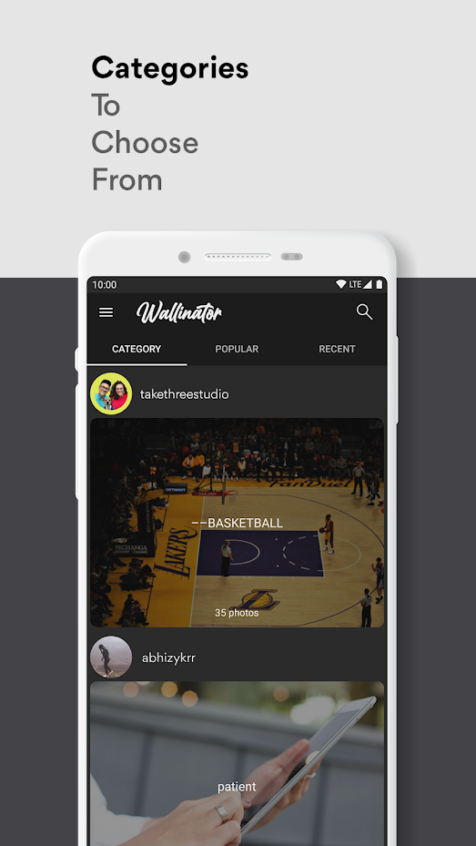
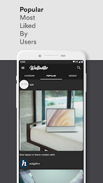

# Wallinator (Android App) 
<!-- 
 -->
## Description & Features
An Android based on the popular unsplash API
* Minimal Design.
* Auto-Wallpaper
* Dark Mode.

## Screenshots

<!--  -->

## Links
[API used](https://unsplash.com/developers)      
[Playstore](https://play.google.com/store/apps/details?id=com.enigmaticdevs.wallinator)
